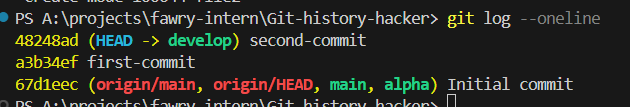
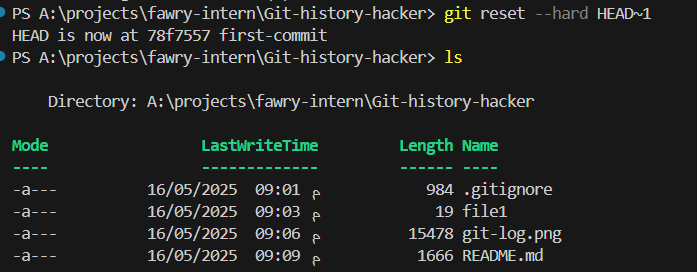
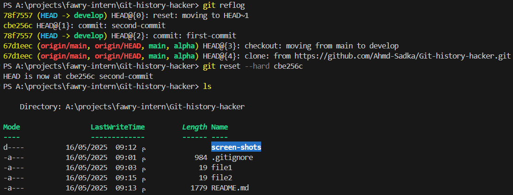
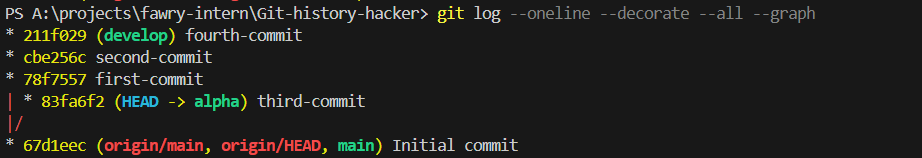
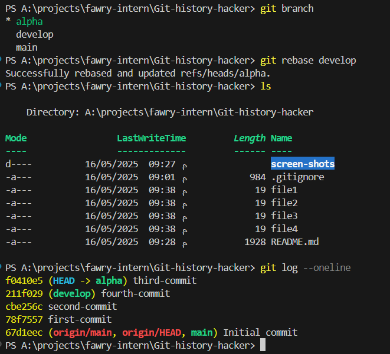

# Git-history-hacker: Git Fundamentals Task

## 📘 Task Overview

This task demonstrates:
- Branch creation and navigation
- Commit history manipulation with `git reset` and `git reflog`
- Graph visualization of Git history
- Rebase operation for linear history

---

## 🌱 Branch Setup

Two branches were created:
- `develop`
- `alpha`

```bash
git branch develop
git branch alpha
```

---

## ✍️ Part 1: Work on `develop` Branch

1. Switched to `develop`.
   - `git checkout develop`
2. Created `file1` and `file2`.
3. Made two commits:
   - `first-commit` for `file1`
   - `second-commit` for `file2`
4. Demonstrated history review and recovery using:
   - `git log --oneline` to view the logs in one-line format
  

   - `git reset --hard HEAD~1`  to move back to the previous commit
   
   
   - `git reflog` to view the log of all commits and reset to second commit
   

---

## 🌿 Part 2: Work on `alpha` Branch

1. Switched to `alpha`.
   - `git checkout alpha`
2. On `alpha`, added and committed `file3`.
3. On `develop`, added and committed `file4`.
4. Visualized the branching structure using:

```bash
git log --oneline --decorate --all --graph
```


---

## 🔁 Part 3: Rebase Operation

Performed a rebase of `alpha` onto `develop` to integrate changes in a clean, linear way:

```bash
git rebase develop
```

---

